# **simple etl playstore dataset**

CSV from [Kaggle](https://www.kaggle.com/datasets/lava18/google-play-store-apps?select=googleplaystore.csv)

## etl proses

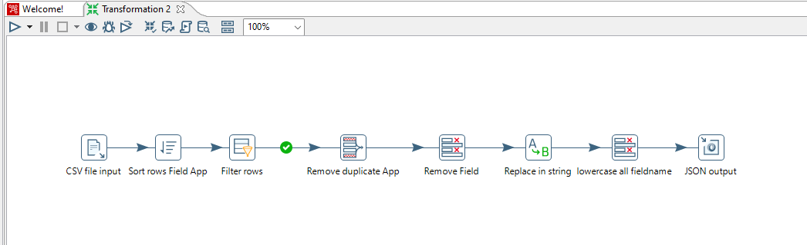

### CSV file input

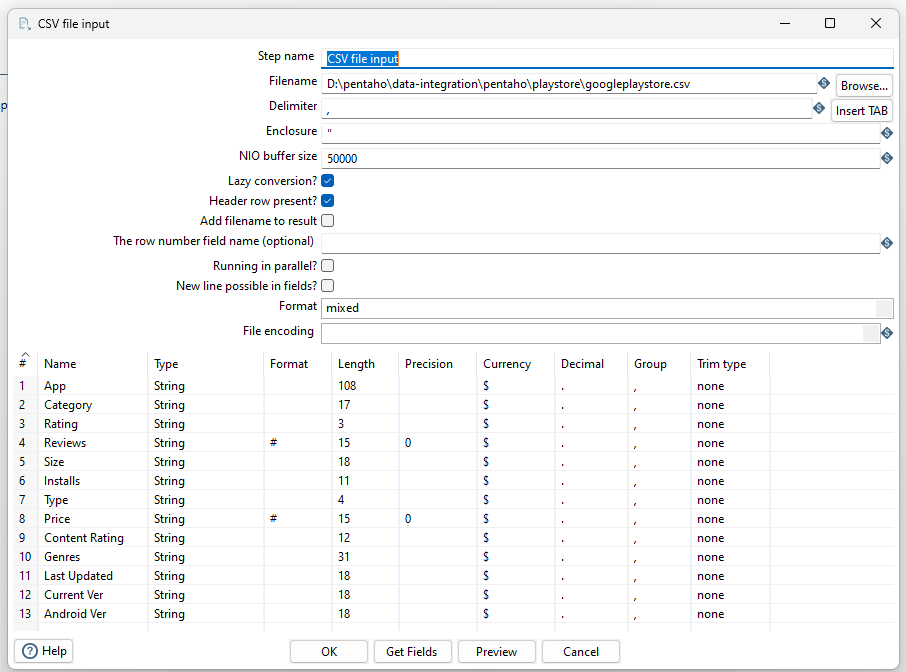

```
importing googleplaystore.csv
```

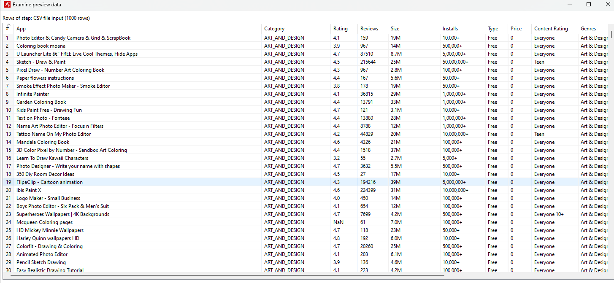

### Sort rows

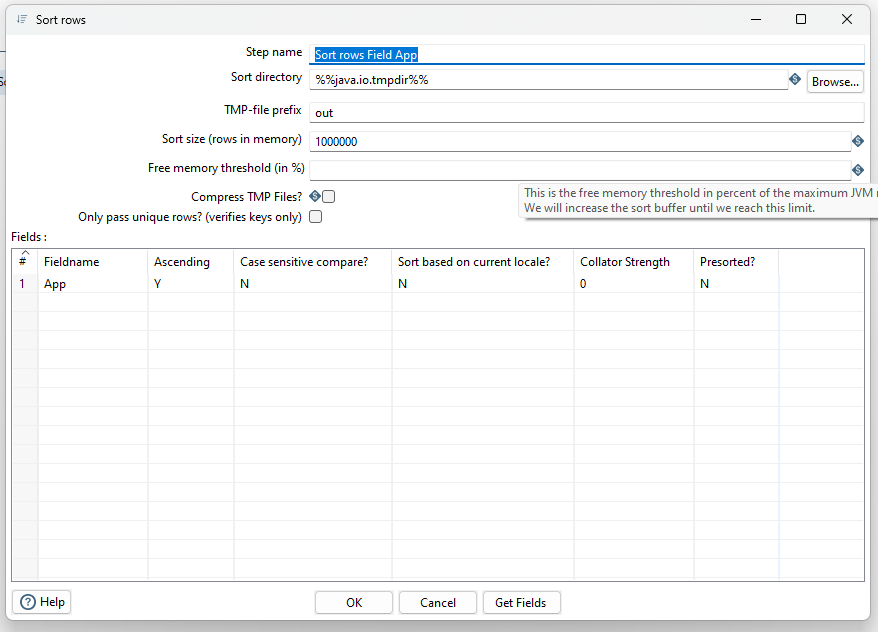

```
sorting field App secara Ascending
```

#### Sort rows result

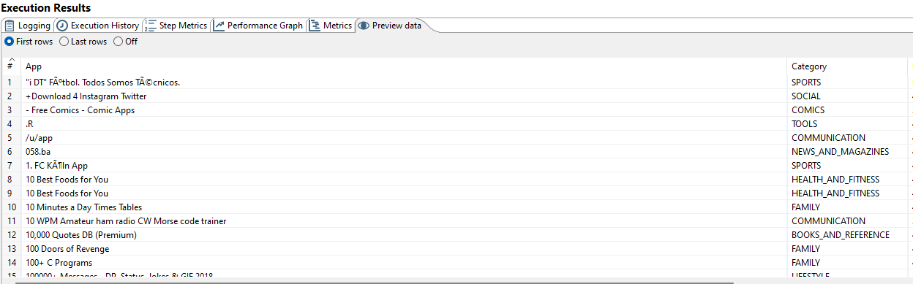

### Filter rows

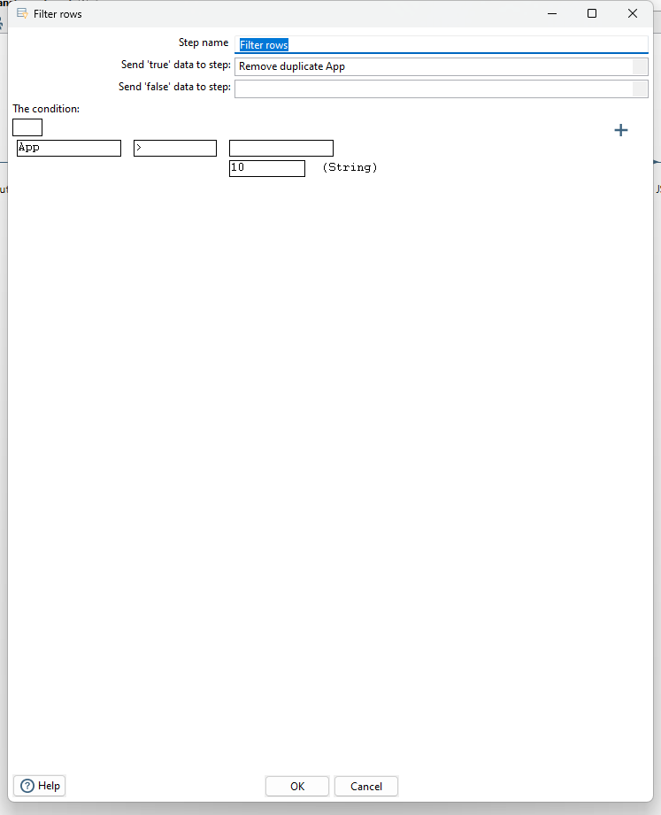

```
menghapus data baris 1 - 7
```

#### Filter rows result

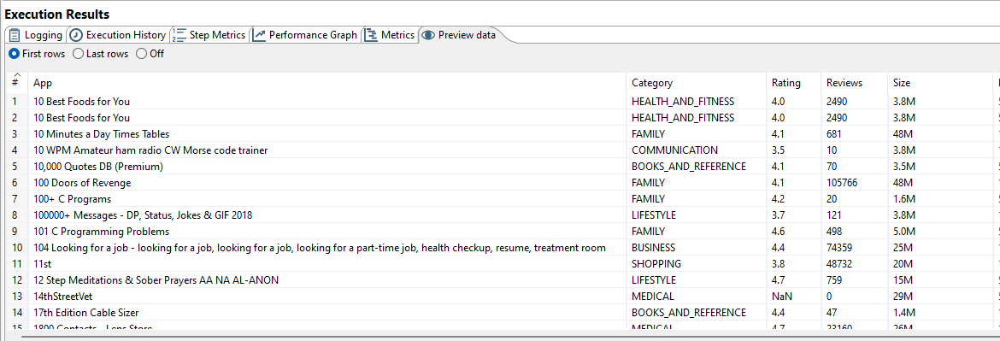

### Unique rows

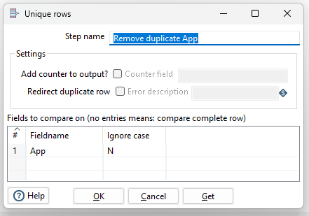

```
menghapus data duplikat pada field App
```

#### Unique rows result

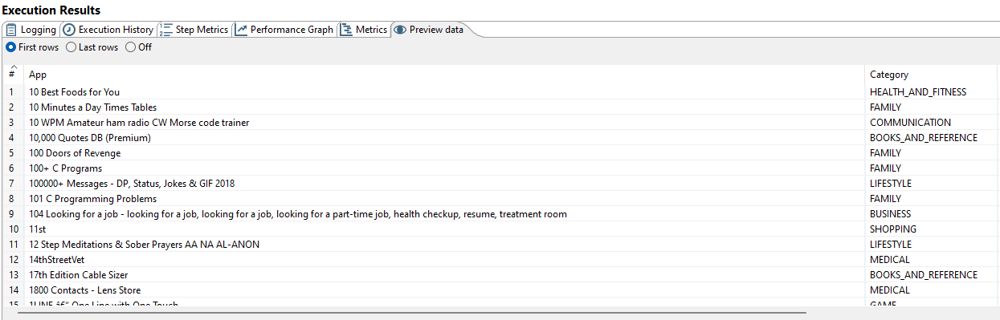

### Select values

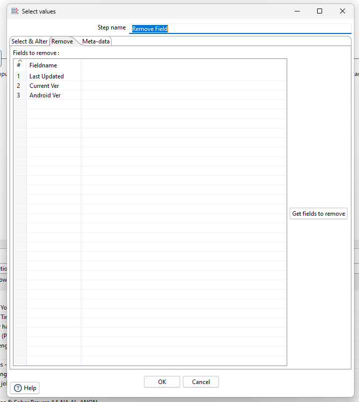

```
menghapus field yang tidak diperlukan
```

#### Before remove field

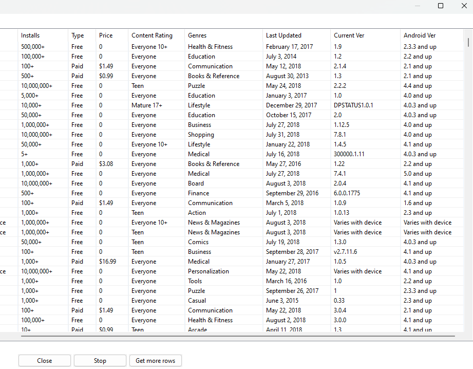

#### After remove field

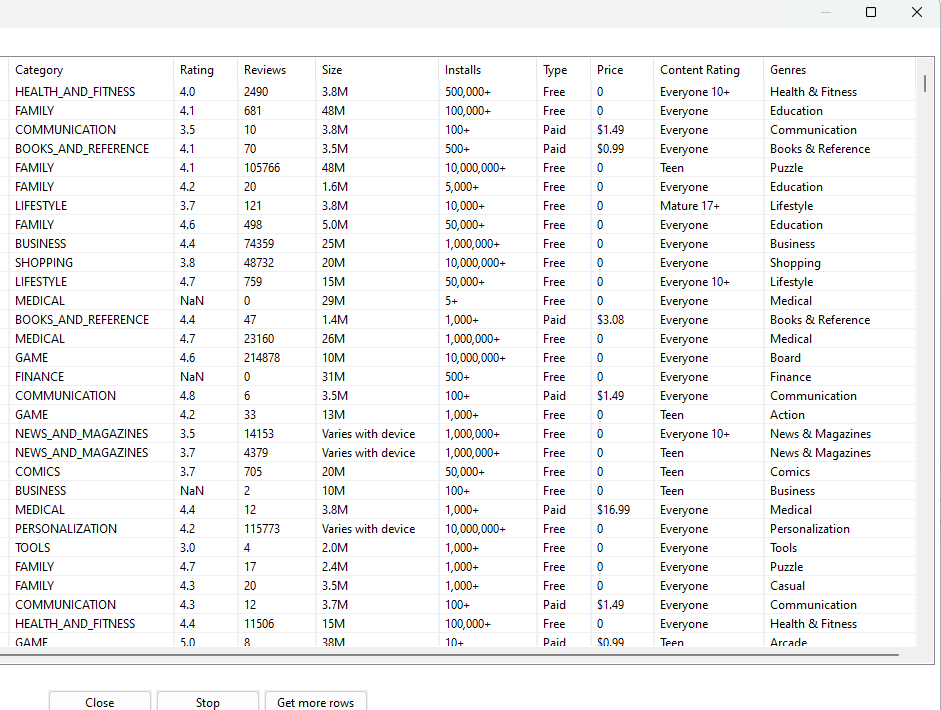

### Replace in string

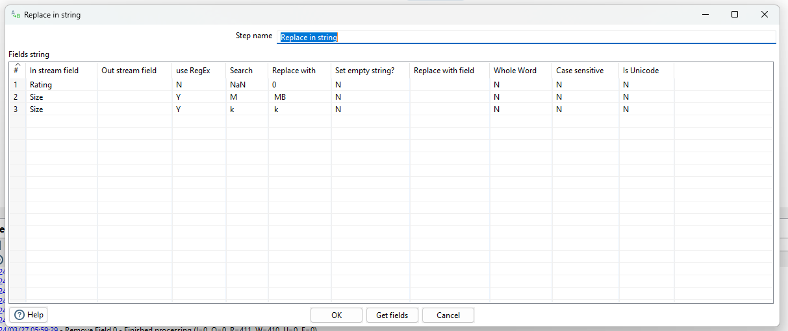

```
Field Rating jika ada value yang nilai nya NaN maka ganti menjadi 0
Field Size cari kata berakhir M ganti dengan " MB" dan juga k ganti dengan " k
```

#### Replace in string result

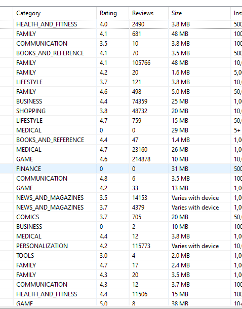

### Select values

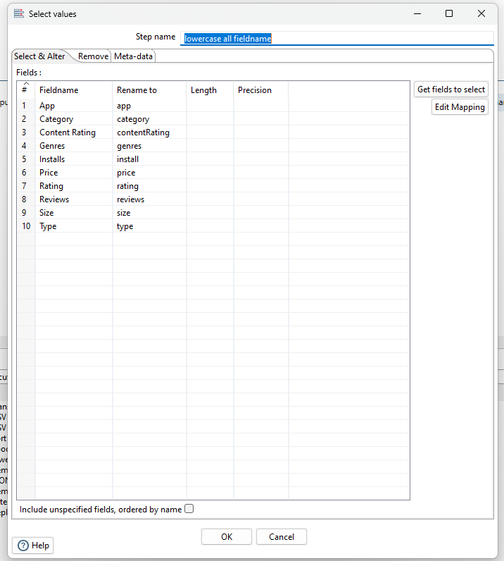

```
Semua Fieldname dirubah menjadi lowercase
```

#### Select values result

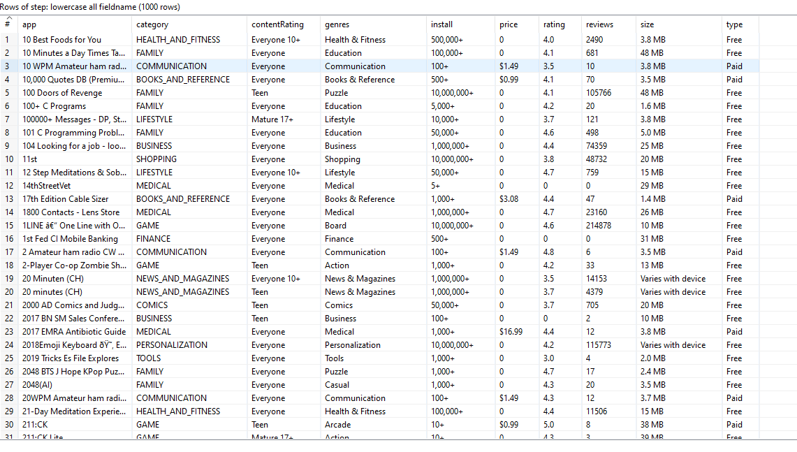

### JSON output

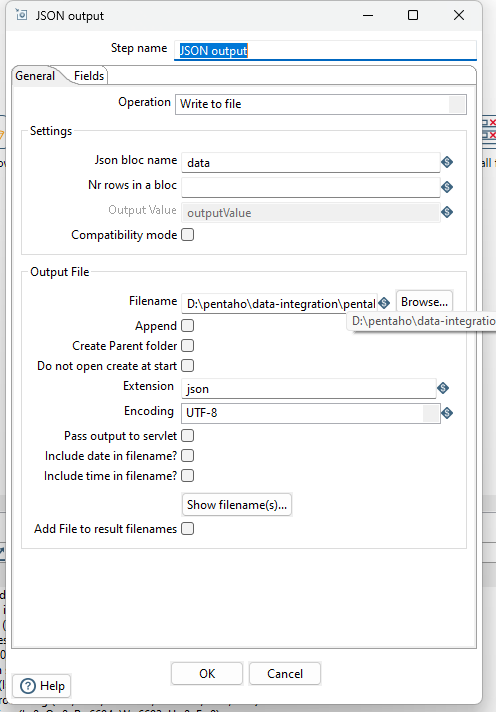

```
Load data CSV kedalam format JSON
```

#### JSON output result

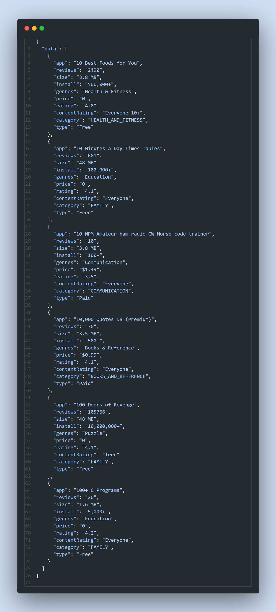
